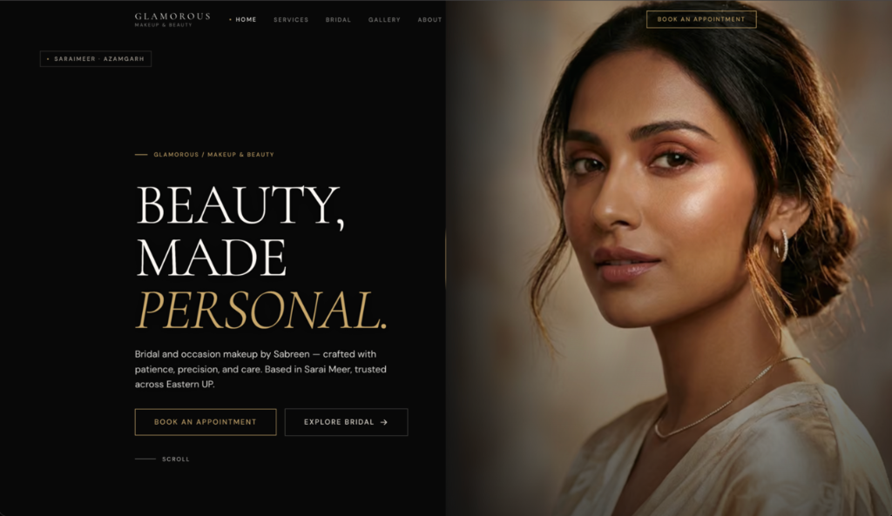

   

  # G L A M O R O U S
  
  **Bespoke Bridal & Luxury Makeup Studio**  
  *Sarai Meer · Azamgarh, Uttar Pradesh*

   

  
  
  

   
   

  

---

## ✦ Live Experience

> **Explore the live boutique web application:**  
> 🔗 **[https://glamorous.superezz.dev](https://glamorous.superezz.dev)**

---

## ✦ Introduction

**Glamorous** is an editorial web application crafted for a boutique bridal artistry and beauty studio founded by **Sabreen** in **Sarai Meer, Uttar Pradesh**.

Built with an unapologetic luxury aesthetic, the platform translates the intimacy, patience, and meticulous craft of high-definition bridal styling into a digital experience:

- **Bespoke Bridal Artistry**: Tailored bridal looks, consultations, trials, and multi-session pre-bridal radiance rituals.
- **Editorial Design Direction**: Warm dark-mode palette (`#080808` Noir, Pale Gold `#C9A86A`, Ivory `#FAF7F2`, Dusty Rose `#C48B8B`), serif typography (*Cormorant Garamond*), and cinematic compositions.
- **Fluid & Accessible**: Responsive from 320px compact mobile screens to 4K displays, with touch swipe gestures, accessible contrast, reduced-motion preferences, and offline PWA resilience.

---

## ✦ Technology Stack

| Layer | Technology | Purpose |
| :--- | :--- | :--- |
| **Framework** | [Next.js 16](https://nextjs.org/) (App Router) | Server-Side Rendering, Static Generation, Dynamic Metadata & SEO |
| **Core Library** | [React 19](https://react.dev/) | Modern concurrent UI architecture & component composition |
| **Language** | [TypeScript](https://www.typescriptlang.org/) | End-to-end type safety across service schemas, pricing & components |
| **Styling & Design System** | Vanilla CSS + CSS Modules | Custom design tokens, fluid clamp typography, zero runtime CSS overhead |
| **Kinetic Motion** | [GSAP 3](https://greensock.com/gsap/) + ScrollTrigger | Editorial entrance sequences, clip-path reveals & smooth parallax |
| **Scroll Ergonomics** | [Lenis](https://github.com/darkroomengineering/lenis) | Inertia-based luxury smooth scrolling synchronized with GSAP ticker |
| **Offline & Reliability** | Progressive Web App (PWA) | Service worker caching, offline resilience & instant asset delivery |
| **Search & Schema** | Schema.org JSON-LD | Structured data for `BeautySalon`, `LocalBusiness`, and service catalogs |

 

  Crafted with quiet intention and patient precision. © 2026 Glamorous Studio.

